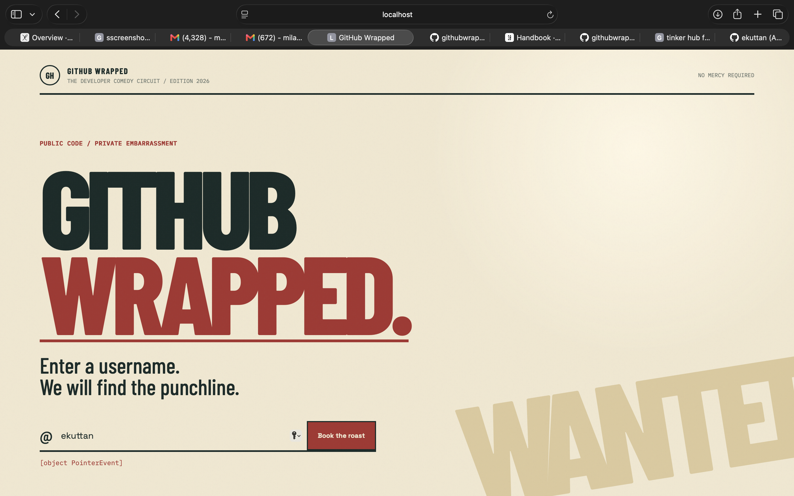
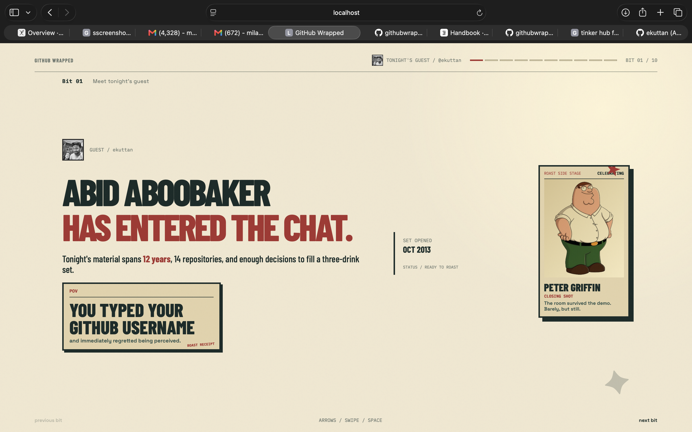
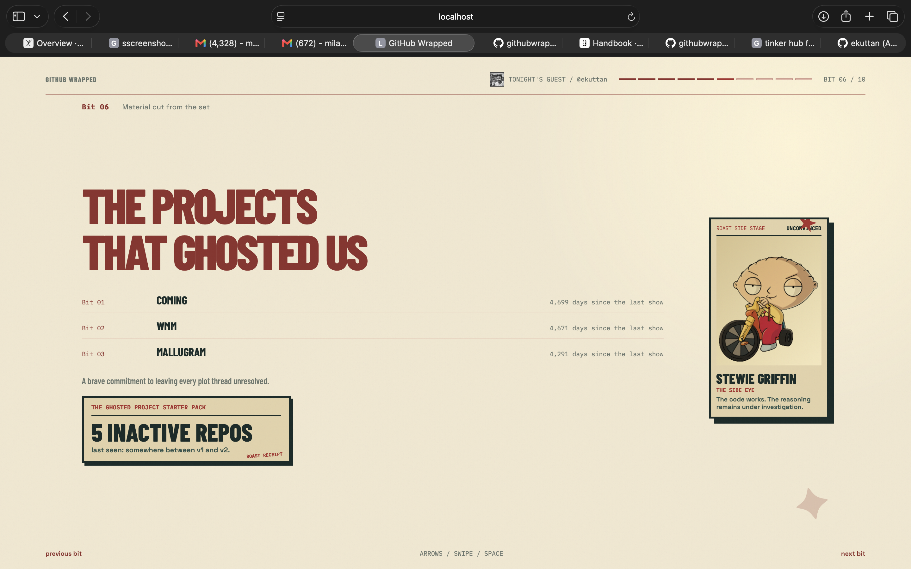
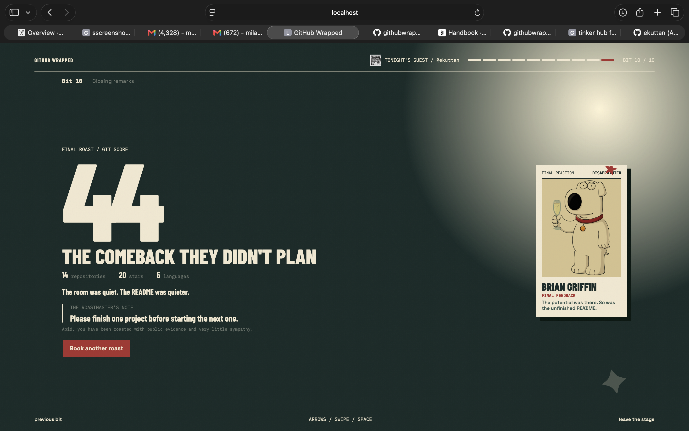
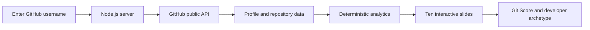

# GitHub Wrapped

GitHub Wrapped is a cinematic developer report for public GitHub profiles. Enter a username and the app turns real repository data into a ten-slide roast show with memes, character side posters, achievements, red flags, a developer archetype, and a final Git Score.

The project is designed as a fast hackathon demo: no login, OAuth, database, accounts, or frontend build step.

## Project Description

GitHub Wrapped reads a public GitHub profile and turns its real repository signals into an entertaining developer personality report. It combines repository data, deterministic analytics, visual memes, character reactions, and a final Git Score without pretending to know private activity.

## The Problem That Does Not Exist

Developers have no reliable way to find out what their public GitHub activity says about them, so we created an unnecessarily dramatic investigation into their repositories.

## The Solution Nobody Asked For

Enter a public GitHub username and GitHub Wrapped fetches the profile, analyzes the repositories, detects patterns, and presents the results as a ten-slide comedy show with real evidence.

## Basic Details

### Team Name: NIK

### Team Members

- Team Lead: Johan Eljo - Sahrdaya College of Engineering and Technology
- Member 2: Milan Krishna - Sahrdaya College of Engineering and Technology


## Live Demo

Open the deployed app:

```text
https://milanbuilds.github.io/githubwrapped/
```

The GitHub Pages build uses public GitHub API requests directly in the browser. The repository also includes `server.js` for local/server-side development and optional server-side GitHub token support.

## How It Works

The Node server in `server.js`:

1. Receives a GitHub username at `GET /api/github?username=<username>`.
2. Fetches the public GitHub user profile.
3. Fetches up to three pages of public repositories.
4. Excludes forked repositories from the core report.
5. Normalizes repository, language, star, fork, follower, and activity data.
6. Returns the report payload to the browser.

The browser in `public/app.js` renders the landing page, loading sequence, ten slides, meme panels, character posters, keyboard navigation, swipe navigation, and restart flow.

## API Endpoint

```text
GET /api/github?username=octocat
```

The response includes:

- Public profile identity
- Avatar and bio
- Followers and following
- Repository list
- Stars and forks
- Primary repository languages
- Created, updated, and pushed dates
- Topics when available
- Inactive repository list
- Top language
- Most-starred repository
- Red flag score
- Git Score
- Deterministic archetype

## Analytics

The analytics calculations are deterministic and based on real returned GitHub data.

### Repository Signals

- Public repository count
- Total stars
- Total forks
- Language distribution
- Top language
- Most-starred repository
- Oldest repository
- Inactive repositories
- Recently active repositories
- Repository naming patterns such as `final`, `temp`, `test`, `v2`, and `new`

### Red Flag Score

The score uses inactivity, repository naming patterns, and lack of stars. It is capped from 0 to 100 and is intended as entertainment, not a professional evaluation.

### Git Score

The visible product language calls the score `Git Score`. Internally the normalized response field remains `aura` for compatibility with the existing analytics implementation. The calculation itself is unchanged.

### Archetypes

The archetype is selected by deterministic rules based on inactivity, naming patterns, language count, stars, and repository count. The UI gives the internal archetypes Roast Roastmaster display names such as:

- The unfinished storyteller
- The bug magnet
- The one-person ecosystem
- The sleeper hit
- The rare follow-through
- The solution looking for a problem

## Ten Slides

1. Guest introduction
2. Repository numbers
3. Primary programming language
4. Achievements
5. Recent activity
6. Ghosted projects
7. Repository spotlight
8. Red flag score
9. Developer verdict
10. Final Git Score and conclusion

Every slide includes a data-aware roast or meme. The right side of the presentation uses one unique poster variant per slide featuring Peter Griffin, Stewie Griffin, or Brian Griffin. The images are loaded from Wikimedia-hosted URLs and have a graceful visual fallback if unavailable.

## Screenshots


The landing screen where a judge enters a public GitHub username.



An example of the report's data-driven roast presentation.



An example of the report content, meme treatment, and character side poster.



The final Git Score, archetype, summary metrics, and closing roast.

## Interaction

- Username form submission
- Five-step loading sequence
- Previous and next controls
- Right and left arrow keys
- Spacebar to advance
- Escape to return home
- Touch swipe navigation
- Analyze another profile action

## Project Structure

```text
server.js             Static server, GitHub proxy, analytics normalization
public/index.html     HTML shell, fonts, layout guard styles
public/app.js         App state, rendering, slides, memes, poster selection
public/styles.css     Visual system, responsive layout, animations
package.json          Run scripts and dependency metadata
.env.example          Optional environment variable reference
```

## Workflow



The browser submits a public GitHub username to the Node server. The server fetches public profile and repository data, normalizes it, and returns the analytics payload. The frontend turns that payload into the interactive GitHub Wrapped report.

## Limitations

- Exact hourly coding history is not available from the data used by this demo, so the app does not invent a peak coding hour.
- Commit counts and commit-message history are not fetched.
- Repository fetching is capped at three pages.
- Unauthenticated GitHub API rate limits can apply.
- Language distribution is based on repository primary-language metadata.
- Remote character images require internet access.
- The report is playful and should not be treated as a real developer assessment.

## Privacy

- No user accounts
- No authentication
- No database
- No profile persistence
- Only public GitHub data is requested
- GitHub tokens, when provided, remain server-side

## Team Contributions

- Johan Eljo: Backend implementation, GitHub API integration, repository fetching, analytics normalization, error handling, and server-side demo reliability.
- Milan Krishna: Frontend implementation, visual system, responsive slide layouts, memes, character side posters, navigation, animations, and README/demo preparation.

## Project Demo

Watch the project demo:

https://drive.google.com/file/d/1eTL3JzPCL7y0ReaBZw0KKLq9v3mRn0Dk/view?usp=sharing

## License And Assets

The application code in this repository is a hackathon/demo project. The Family Guy character poster images are remote Wikimedia-hosted assets used for the visual demo and remain subject to their respective rights and licenses. Replace them with permitted assets for public production use.
